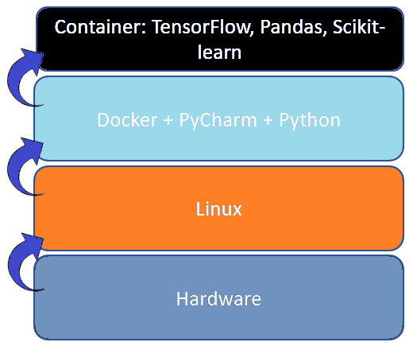

# Project container setup and files

PyCharm recognizes this automatically. Set project interpreter point to
this container to have all the libraries in use.

The container image needs to be rebuilt if updates occur.

Build the container:    
$ docker build -t lokari:test .

Start the container in interactive mode:  
$ docker run --name lokaritest -it lokari:test  

**WARNING COMMAND BELOW MAKES DYNAMICAL COPY OF LOCAL FOLDERS IN CONTAINER DO NOT EDIT ANYTHING INSIDE CONTAINER AS ITS RUN AS ROOT.** \
Docker command for debugging. Open docker container with Bash, removed when exit, copy local Github folder and Apache access.logs, replace USER in command to mach your directory structure: \
$ sudo docker run --rm -v /home/USER/AI-Project/:/AI-Project -v /var/log/apache2:/var/log/apache2/ -it lokari:test

## Environment

