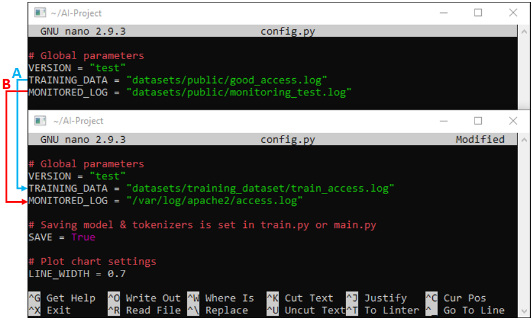
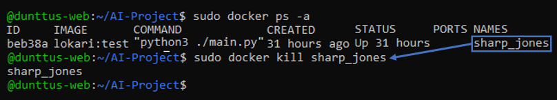

# Lokari installation
# Log format
Web server logs have to be in right format for Lokari to work:
```
"11/Apr/2020/10:13:18" "192.168.10.61" "200" "12" "157" "GET" "/index.html/?hello" "HTTP/1.1"
```
### Log format configuration: Apache2
Log format is configured in /etc/apache2/apache2.conf:
\

\
A) /var/log/apache2/other_vhosts_access.log – These logs are used for virtual host page. \
B) /var/log/apache2/access.log – These are for Apache2 default page logs.
\
Log formats:
```
LogFormat "\"%{%d/%b/%Y/%T}t\" \"%h\" \"%>s\" \"%B\" \"%D\" \"%m\" \"%U/%q\" \"%H\"" vhost_combined
LogFormat "\"%{%d/%b/%Y/%T}t\" \"%h\" \"%>s\" \"%B\" \"%D\" \"%m\" \"%U/%q\" \"%H\"" combined
```
Log tags explained:
```
%{%d/%b/%Y/%T}t = Time stamp
%h = IP address
%>s = Status code
%B = Bytes sent
%D = Request time taken
%m = Method
%U%q = Path and query
%H = Protocol
```

## Log format: Nginx
The following configurations make Nginx logs compatible with Lokari. Note that all the logs have to be in this format, or the training phase fails.
```
/etc/nginx/nginx.conf
http { 
    log_format	lokari	'"$time_local" "$remote_addr" "$status" "$bytes_sent" "$request_time" "$request_method" "$request_uri" "$server_protocol"';
    
    server {
        access_log /var/log/nginx/access.log lokari;
    }
}
```

# Local installation

First Install Python3 and git
```
sudo apt-get install python3 git
```
This step might take a while since Tensorflow packets are quite big.
```
pip3 install tensorflow pandas scikit-learn matplotlib
```
Clone the project folder.
```
git clone https://github.com/Dunttus/AI-Project.git
```
### Local: Make dataset
Manually combine all access.logs to 1 file or run combine_apachelogs.sh bash script as shown below.
```
bash ./combine_apachelogs.sh
```
File for model training "train_access.log" is now located in /AI-Project/datasets/training_dataset/ and should look similar to this test file https://github.com/Dunttus/AI-Project/blob/master/datasets/public/good_access.log \
\
**Skip to "Local: Train model" if you used combine_apachelogs.sh** \
If you want to use different folder structure you can change Bash script variables manually to absolute paths in DATASAVING FOLDER and ACCESS.LOG LOCATION or by making dataset manually with Linux commands.
```
#!/bin/bash
folderdata=DATASAVING FOLDER
folderlog=APACHE2 ACCESS.LOG LOCATION

cp $folderlog/access.log.* $folderdata
gunzip $folderdata/access.log.*
cat $folderdata/access.log.* > $folderdata/train_access.log
rm $folderdata/access.log.*
```
### Local: Train model
Using Tensorflow in GPU mode requires local Nvidia drivers and CUDA installation, else it will train model with CPU by default. CUDA supported GPU can be found in NVIDIAs site https://developer.nvidia.com/cuda-gpus. \
\
Next navigate to settings file in /AI-Project/config.py and open it with nano.
```
nano config.py
```
Change TRAINING_DATA = "datasets/training_dataset/train_access.log" to match your new log file. \
We will also change MONITORED_LOG = "/var/log/access.log" to target monitoring in apache2 logs folder access.log we will use this after training the model. \
Picture of old config.py and new config.py below. \

\
A) TRAINING_DATA is used to train model. \
B) MONITORED_LOG is to monitor incoming Apache2 logs. \
Then we run /AI-Project/train.py with Python3 to train the model.
```
python3 ./train.py
```
### Local: Using trained model
After model is trained we can start monitoring access.log by running /AI-Project/main.py with Python3.
```
python3 ./main.py
```
Now machine learning model is monitoring your Apache2 log anomalies. Simplest way to put program to run in foreground is CTRL+Z and to return it just type command fg. Monitoring can be stopped with CTRL+C.
  
  
# Docker installation
### Docker: Latest version of Docker
Dockers latest version installation from [docker.com](https://docs.docker.com/engine/install/ubuntu/). \
If you have old docker installations “docker, docker-engine, docker.io, containerd and runc” they need to be uninstalled and Linux version info updated with “sudo apt-get update“.
\
First we need to allow apt to install packages via HTTPS (requires CURL):
```
sudo apt-get install \
apt-transport-https \
ca-certificates \
curl \
gnupg-agent \
software-properties-common
```
Add Docker GPG-key to apt installation.
```
curl -fsSL https://download.docker.com/linux/ubuntu/gpg | sudo apt-key add -
```
Adds docker.com custom packages to apt’s package management.
```
sudo add-apt-repository \
"deb [arch=amd64] https://download.docker.com/linux/ubuntu \
$(lsb_release -cs) \ stable"
```
Updates Linux version information.
```
sudo apt-get update
```
Installs docker-ce docker-ce-cli ja containerd.io packages.
```
sudo apt-get install -y docker-ce docker-ce-cli containerd.io
```
Check version information of Docker.
```
docker --version
```
### Docker: Project container setup and files

Install git
```
sudo apt-get install git
```
Clone project folder.
```
git clone https://github.com/Dunttus/AI-Project.git
```

Navigate to folder with Dockerfile /AI-Project/docker/ and build image from Dockerfile.
```
sudo docker build -t lokari:test .
```

### Docker: Make dataset
We will make all preparations for files in local computer as we will import them to 1-time use Docker container in dynamical mode. \
Manually combine all access.logs to 1 file or run combine_apachelogs.sh Bash script inside install folder as shown below.
```
sudo bash ./combine_apachelogs.sh
```
File for model training "train_access.log" is now located in /AI-Project/datasets/training_dataset/ and should look similar to this test file https://github.com/Dunttus/AI-Project/blob/master/datasets/public/good_access.log \
\
**Skip to "Local: Train model" if you used combine_apachelogs.sh** \
If you want to use different folder structure you can change Bash script variables manually to absolute paths in DATASAVING FOLDER and ACCESS.LOG LOCATION or by making dataset manually with Linux commands.
```
#!/bin/bash
folderdata=DATASAVING FOLDER
folderlog=APACHE2 ACCESS.LOG LOCATION

cp $folderlog/access.log.* $folderdata
gunzip $folderdata/access.log.*
cat $folderdata/access.log.* > $folderdata/train_access.log
rm $folderdata/access.log.*
```

### Docker: Training model
Next navigate to settings file in /AI-Project/config.py and open it with nano.
```
nano config.py
```
Change TRAINING_DATA = "datasets/training_dataset/train_access.log" to match your new log file. \
We will also change MONITORED_LOG = "/var/log/access.log" to target monitoring in apache2 logs folder access.log we will use this after training the model. \
Picture of old config.py and new config.py below.
\
  \
A) TRAINING_DATA is used to train model. \
B) MONITORED_LOG is to monitor incoming Apache2 logs. \
Container run train.py inside container, removed when exit or done, with local AI-Project and Apache2 log folders dynamically, replace USER in command to match your directory structure:
```
sudo docker run -it --rm -v /home/USER/AI-Project/:/AI-Project/ -v /var/log/apache2:/var/log/apache2/ -w /AI-Project lokari:test python3 ./train.py
```
Stop container with CTRL+C.

### Docker: Using model
After training your model to use it chance what log you want to monitor in local computer file /AI-Project/config.py edit MONITORED_LOG = "/var/log/access.log". Start monitoring access.log by running main.py in container with Python3.
Container run main.py inside container, removed when exit or done, with local AI-Project and Apache2 log folders dynamically, replace USER in command to match your directory structure:
```
sudo docker run -it --rm -v /home/USER/AI-Project/:/AI-Project/ -v /var/log/apache2:/var/log/apache2/ -w /AI-Project lokari:test python3 ./main.py
```
Stop container with CTRL+C.

### Docker: Monitoring main.py container in foreground
Container run main.py inside container, removed when exit or done, with local AI-Project and Apache2 log folders dynamically, replace USER in command to mach your directory structure:
```
sudo docker run -d --rm -v /home/USER/AI-Project/:/AI-Project/ -v /var/log/apache2:/var/log/apache2/ -w /AI-Project lokari:test python3 ./main.py
```
When you want to close main.py container use generated name as shown below.
```
sudo docker ps -a
```
Kill container with generated id shown by ps docker -a command. \

```
sudo docker kill sharp_jones
```
If monitoring tool has found any anomaly logs you can find then from /var/log/apache2/access.log.anomalies.

**WARNING COMMAND BELOW MAKES DYNAMICAL COPY OF LOCAL FOLDERS IN CONTAINER DO NOT EDIT ANYTHING INSIDE CONTAINER AS ITS RUN AS ROOT.** \
Docker command for debugging. Open docker container with Bash, removed when exit, copy local Github folder and Apache access.logs, replace USER in command to match your directory structure:  
```
sudo docker run --rm -v /home/USER/AI-Project/:/AI-Project -v /var/log/apache2:/var/log/apache2/ -it lokari:test
```
