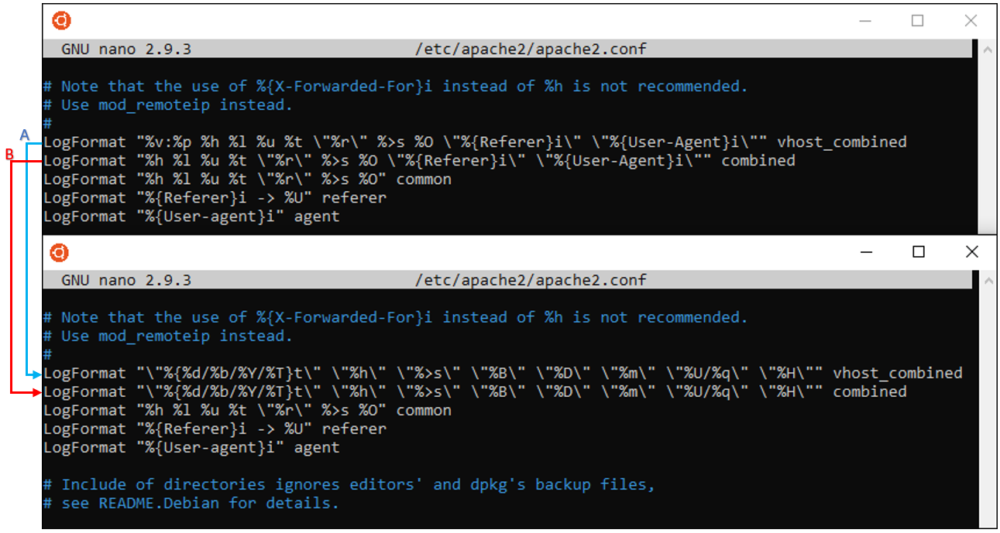

# Help for install
Model to work correctly requires normal state of Apache2 server logs in right format. \
Log format sample:
```
"11/Apr/2020/10:13:18" "192.168.10.61" "200" "12" "157" "GET" "/index.html/?hello" "HTTP/1.1"
```
## Apache2 access.log formatting
Simplest way to use Apache2 logs in Machine learning model is to reformat logs directly from Apache2. Open settings file from /etc/apache2/apache2.conf, log formats for access.log and other_vhost_access.log are located on lines 212-213 change it to mach new format as show in picture below.
\

\
A) /var/log/apache2/other_vhosts_access.log – These logs are used for virtual host page. </p> 
B) /var/log/apache2/access.log – These are for Apache2 default page logs.
\
Log formats:
```
LogFormat "\"%{%d/%b/%Y/%T}t\" \"%h\" \"%>s\" \"%B\" \"%D\" \"%m\" \"%U/%q\" \"%H\"" vhost_combined
LogFormat "\"%{%d/%b/%Y/%T}t\" \"%h\" \"%>s\" \"%B\" \"%D\" \"%m\" \"%U/%q\" \"%H\"" combined
```
Log tags explained:
```
%{%d/%b/%Y/%T}t = Time stamp
%h = IP address
%>s = Status code
%B = Bytes sent
%D = Request time taken
%m = Method
%U%q = Path and query
%H = Protocol
```
## Docker install
### Latest version of Docker
Dockers latest version installation from [docker.com](https://docs.docker.com/engine/install/ubuntu/). \
If you have old docker installations “docker, docker-engine, docker.io, containerd and runc” they need to be uninstalled and Linux version info updated with “sudo apt-get update“.
\
First we need to allow apt to install packages via HTTPS (requires CURL):
```
sudo apt-get install \
apt-transport-https \
ca-certificates \
curl \
gnupg-agent \
software-properties-common
```
Add Docker GPG-key to apt installation.
```
curl -fsSL https://download.docker.com/linux/ubuntu/gpg | sudo apt-key add -
```
Adds docker.com custom packages to apt’s package management.
```
sudo add-apt-repository \
"deb [arch=amd64] https://download.docker.com/linux/ubuntu \
$(lsb_release -cs) \ stable"
```
Updates Linux version information.
```
sudo apt-get update
```
Installs docker-ce docker-ce-cli ja containerd.io packages.
```
sudo apt-get install -y docker-ce docker-ce-cli containerd.io
```
Check version information of Docker.
```
docker --version
```
### Project container setup and files
Navigate to folder with Dockerfile /AI-Project/docker/ and build image from Dockerfile.
```
docker build -t lokari:test .
```
Open docker container in Bash, removed when exit, with local Github folder and Apache access.logs:
```
docker run --rm -v /home/USER/AI-Project/:/AI-Project -v /var/log/apache2:/accesslog -it lokari:test
```

## Manual install
Skip this if you did Docker installation. \
Install Python3.
```
sudo apt-get install python3
```
Install Tensorflow.
```
pip3 install tensorflow
```
Install Pandas.
```
pip3 install pandas
```
Install Scikit-Learn.
```
pip3 install scikit-learn
```
Install Matplotlib.
```
pip3 install matplotlib
```
## Train model
Using Tensorflow in GPU mode requires local Nvidia drivers and CUDA installation, else Tensorflow will train model with CPU by default. CUDA supported GPU can be found in NVIDIAs site https://developer.nvidia.com/cuda-gpus. \
Manually combine all access.logs to 1 file or use this Bash script with right folders (will work by default in Docker container).
```
#!/bin/bash
folder=/AI-Project/datasets/training_dataset
cp /accesslog/access.log.* $folder
gunzip $folder/access.log.*
cat $folder/access.log.* > $folder/train_access.log
rm $folder/access.log.*
```
Next navigate to settings file in /AI-Project/config.py and edit TRAINING_DATA = "datasets/training_dataset/train_access.log" to mach your new log file.
Then just run /AI-Project/train.py with Python3
```
python3 ./train.py
```
## Using trained model
To use trained model just chance what log you want to monitor in /AI-Project/config.py file edit MONITORED_LOG = "accesslog/access.log". Start monitoring access.log by running main.py with Python3.

```
python3 ./train.py
```